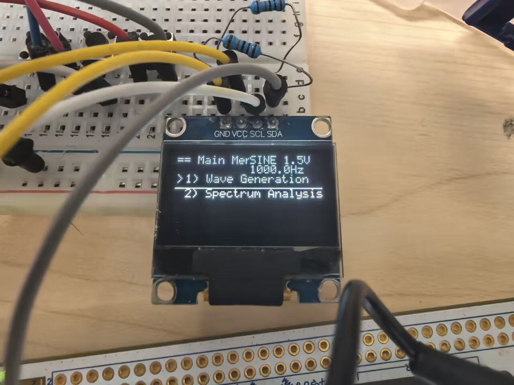
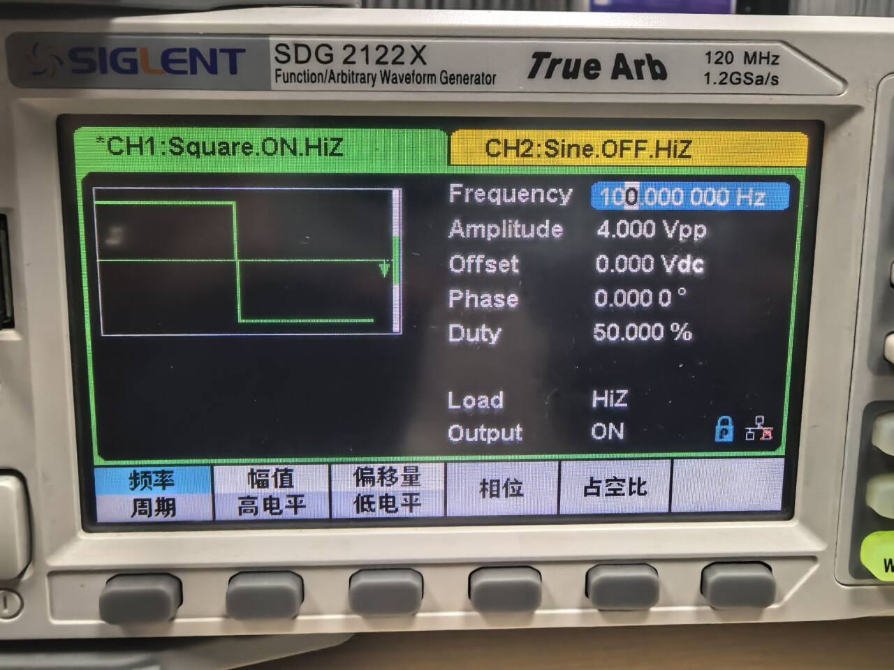
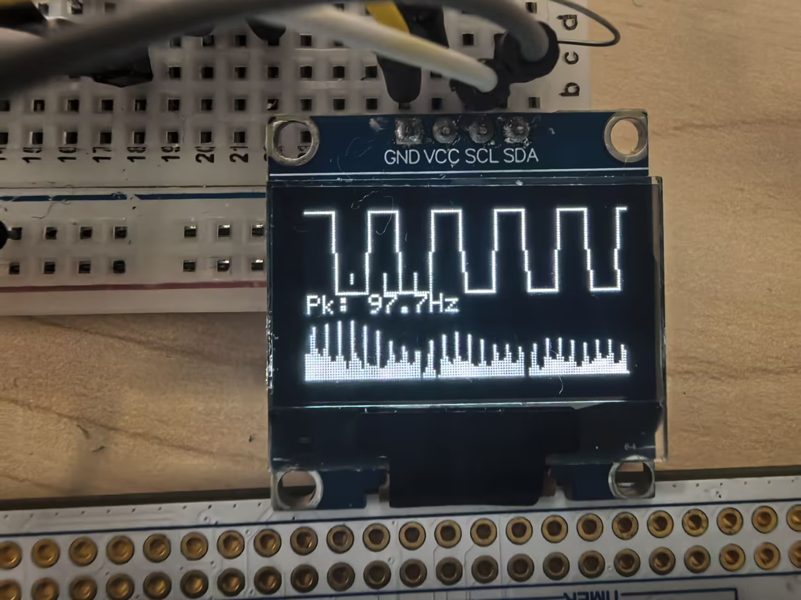

# STM32H745 Waveform Generator & Spectrum Analyzer (OLED UI)

An embedded prototype based on STM32H745 that integrates:
- Waveform generation (sine/square/triangle)
- ADC sampling + FFT spectrum analysis
- OLED (SSD1306) UI with 4 buttons for parameter control

## Hardware
- MCU board: STM32H745 (dual-core M7/M4, this project uses M7 only)
- OLED: SSD1306 via I2C
- Buttons: 4 keys for menu/confirm/back/adjust

### Pin Mapping
- I2C OLED: PB8 (SCL), PB9 (SDA)
- DAC output: PA4  -> waveform output to oscilloscope / DUT
- ADC input: PF6   -> sampled signal for spectrum analysis
- Buttons: PC13 / PE2 / PE4 / PE5

## Firmware Architecture
- Clock: SYSCLK = 240 MHz via PLL (board limitation under Direct-SMPS)
- Waveform generation:
  - Timer-triggered DAC output
  - DMA table driving (sine/square/triangle)
  - Frequency adjustment via ARR, amplitude via table scaling
- Sampling:
  - ADC DMA circular sampling buffer: 2048 points
- Spectrum:
  - Use 1024 points FFT (CMSIS-DSP)
  - Real->complex (imag=0), magnitude spectrum + peak detection

## Development Environment
- STM32CubeIDE (with CubeMX configuration)

## Build & Flash
1. Open STM32CubeIDE
2. File -> Import -> Existing Projects into Workspace
3. Select this repository root folder (it contains .project / project_new.ioc)
4. Build the CM7 project (Debug)
5. Flash using ST-LINK

## Demo

## Notes / Troubleshooting
- If you do NOT use M4 core, ensure the project does not block on M7<->M4 synchronization code.
